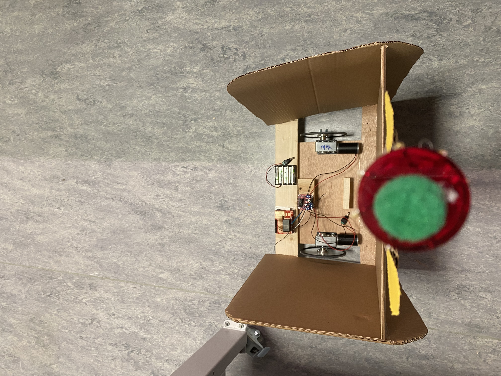
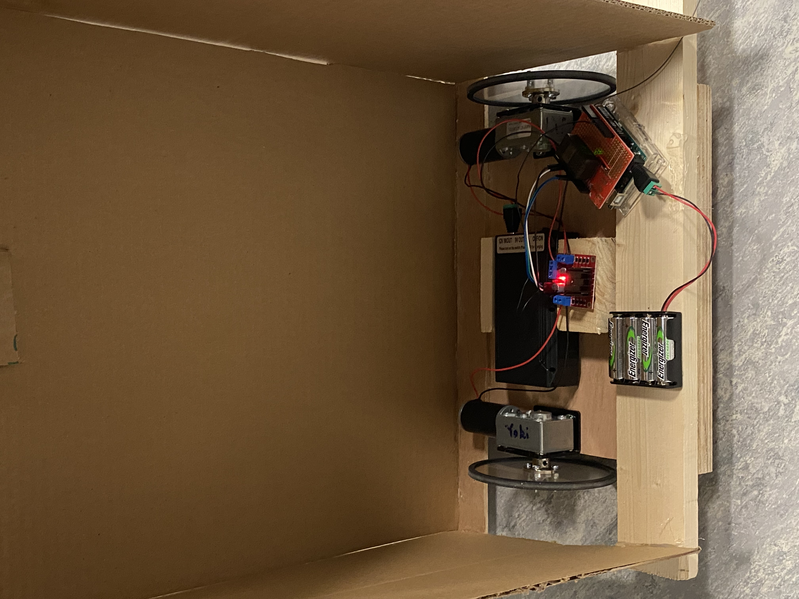
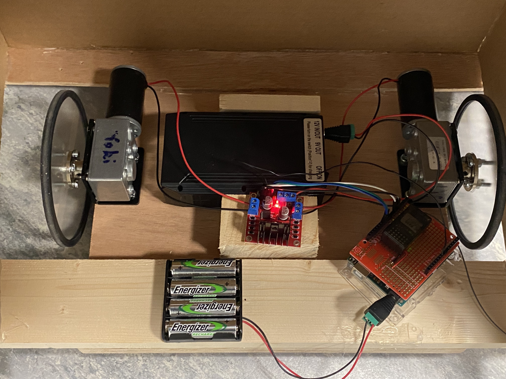

Progress
----------

Movement
------------
By using Hobby RC System， our robot is programmd to be able to move forward and backward, change speed, and steer. Channel 1 (the big knob on the right) is to control the direction of forward and backward. Channel 2 (the trigger below) is to change the speed by map the ranges of read value 900-2050 to the analogWrite value 0-255. Channel 3 (the small knob on the right) is to steer the robot by adjusting the speed of one of the motors.

[Here](https://youtu.be/MezK8WZPiIQ) is the video

