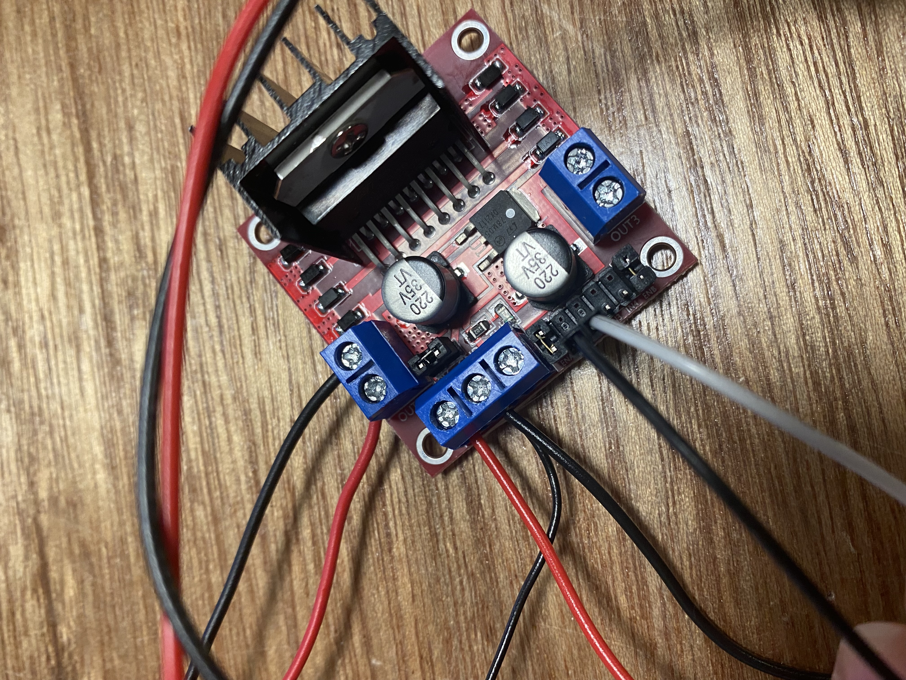
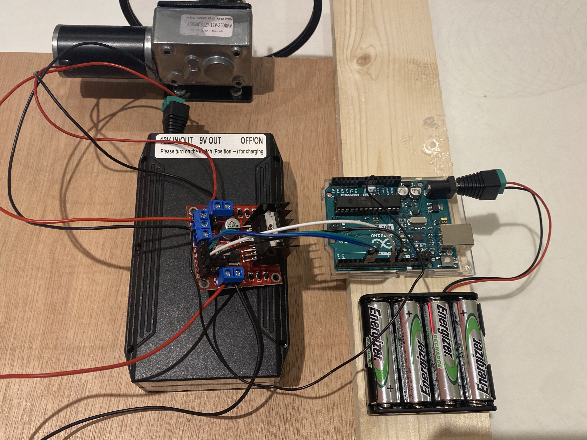
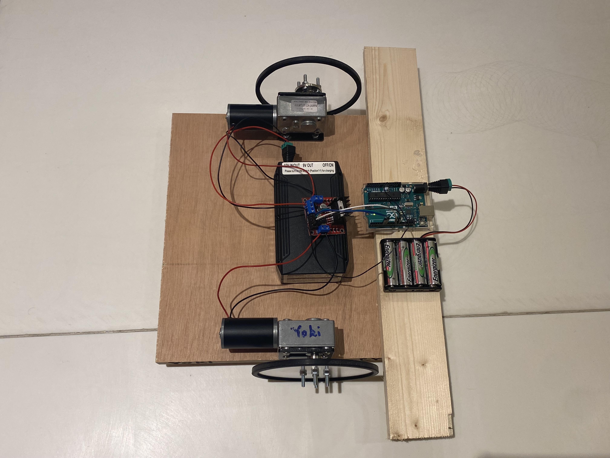

Progress
----------

We built the circuit and fixed all the components using wood glue and hot glue gun, and we then placed an additional scrap wood that allowed the chassis to be balanced.

Basic Movements
----------
Yupu and I first played with three movements that make our robot walk forward, backward, and spin in place.
[Here](https://youtube.com/shorts/JU0lua4huuM) is the video

Personality
----------
By accelerating the robot and making it circle around a fixed point, we simulated a puppy running up to his hooman and happily circling around.
Click [Here](https://youtu.be/OL6Z8BL6Py8) to see a robot puppy :))

